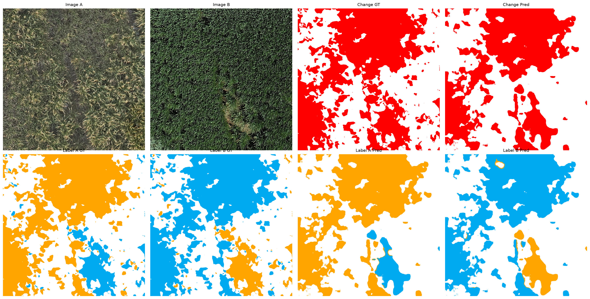

# DiffFormer-SCD

Semantic Change Detection with **Diff**erence-Token Trans**Former** and Asymmetric Bidirectional Distillation for high-resolution remote sensing images.

Given two co-registered satellite images at different times, the model simultaneously detects *where* land-cover changes occurred and classifies *what* the before/after types are.



## Highlights

- **DiffFormer** — a difference-token Transformer that uses learnable tokens attending over patch-wise difference embeddings to capture global temporal change patterns.
- **Asymmetric Bidirectional Distillation (ASD)** — mutual knowledge transfer between the semantic segmentation and change detection branches:
  - *Sem → CD*: semantic difference guides change probability
  - *CD → Sem*: change map enforces semantic consistency in unchanged regions and aligns boundaries in changed regions.

## Installation

```bash
pip install torch torchvision tensorboardX tqdm scikit-image opencv-python scipy numpy matplotlib
```

## Dataset preparation

```
<datapath>/
  A/           # RGB images at time A (.png)
  B/           # RGB images at time B (.png)
  label1/      # semantic labels for time A (class-index .png, 0 = unchanged)
  label2/      # semantic labels for time B (class-index .png, 0 = unchanged)
  list/
    train.txt  # filenames without extension, one per line
    val.txt
    test.txt
```

The binary change label is derived automatically: any pixel where label ≠ 0 is considered "changed".

## Training

```bash
python train.py \
    --dataname "Landsat" \
    --datapath "/path/to/dataset" \
    --num_classes 5 \
    --epoch 50 \
    --train_batchsize 4 \
    --lr 0.01
```

Key hyperparameters:

| Argument | Default | Description |
|---|---|---|
| `--distill_T` | 2.0 | Temperature for semantic softmax |
| `--distill_alpha` | 10.0 | Scale for Sem→CD target mapping |
| `--distill_tau` | 0.05 | Threshold for Sem→CD target |
| `--lambda_s2c` | 0.2 | Weight for Sem→CD loss |
| `--lambda_c2s` | 0.2 | Weight for CD→Sem loss |
| `--lr_decay_power` | 1.5 | Polynomial LR decay exponent |

Checkpoints are saved under `checkpoints/<dataname>/<modelname>/run_XXXX/` when the Sek metric improves.

## Testing

```bash
python test.py \
    --dataname "Landsat" \
    --datapath "/path/to/dataset" \
    --num_classes 5 \
    --ckptpath "checkpoints/Landsat/DiffFormer_ABD/run_0000/best.pth"
```

## Visualization

Generate per-sample prediction visualizations (input images, GT labels, predicted labels, change maps):

```bash
python vis_test.py
```

Output per sample:
- `img_A.png / img_B.png` — original images
- `label_A_gt.png / label_B_gt.png` — ground truth labels (colorized)
- `label_A_pred.png / label_B_pred.png` — predicted labels (colorized)
- `change_gt.png / change_pred.png` — change detection maps
- `overview.png` — 8-panel composite figure

## Metrics

| Metric | Description |
|---|---|
| OA | Overall pixel accuracy |
| mIoU | Mean IoU over all classes |
| Sek | Kappa × exp(IoU_fg) / e — combined metric for change detection quality |
| Fscd | Harmonic mean of semantic change precision and recall |

Model selection uses **Sek** as the primary metric.

## Architecture

```
x1 (T1 image)  →  FCN (ResNet34)  →  Dec1  →  Semantic Map A
                                   ↗
x2 (T2 image)  →  FCN (ResNet34)  →  Dec2  →  Semantic Map B
                      ｜
                      ｜ patch difference
                      ↓
                 DiffFormer           →  DecCD →  Change Map
              (token-attended
            diff embeddings)
                      ↕
          Bidirectional Distillation
              Sem ←→ CD
```

- **Backbone**: ResNet34 FCN with stride=1 in layers 3 & 4 (1/8 spatial resolution)
- **DiffFormer**: 16 learnable difference tokens, 3-layer Transformer (8 heads, 128-dim), patch-wise difference embeddings
- **Decoders**: transposed convolution (kernel=7, stride=2) with skip connections
- **~24M parameters**

## Example results

Results on a non-agriculturalization dataset (1024×1024, 5 classes):

| OA | mIoU | Sek | Fscd |
|---|---|---|---|
| 85.8% | 75.2% | 49.2% | 83.5% |

Class legend: ▢ unchanged · ▢ farmland · ▢ desert · ▢ building · ▢ water

## License

This project is for non-commercial research use only.
